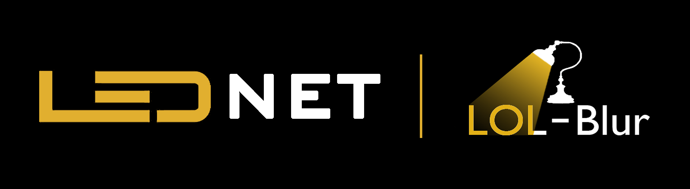

<p align="center">
  
</p>

## LEDNet: Joint Low-light Enhancement and Deblurring in the Dark (ECCV 2022)

[Paper](https://arxiv.org/abs/2202.03373) | [Project Page](https://shangchenzhou.com/projects/LEDNet/) | [Video](https://youtu.be/450dkE-fOMY) | [Replicate Demo](https://replicate.com/sczhou/lednet)

[Shangchen Zhou](https://shangchenzhou.com/), [Chongyi Li](https://li-chongyi.github.io/), [Chen Change Loy](https://www.mmlab-ntu.com/person/ccloy/) 

S-Lab, Nanyang Technological University

### Updates

- **2022.09.30**:  Upload LOLBlur dataset to [BaiduPan](https://pan.baidu.com/s/1CPphxCKQJa_iJAGD6YACuA) (key: dz6u) for quick download in China :cn:
- **2022.09.27**:  Upload LOLBlur dataset to [Google Drive](https://drive.google.com/drive/folders/11HcsiHNvM7JUlbuHIniREdQ2peDUhtwX?usp=sharing).
- **2022.09.27**:  The code and pre-trained models are released :hugs:
- **2022.07.04**:  This repo is created.

### TODO
- [ ] Built and train a new network for low-light enhancement
- [ ] Add checkpoint of LEDNetGAN (trained with GAN)
- [x] Add checkpoint of retrained LEDNet (retrained on BasicSR)
- [x] Add checkpoint of LEDNet in paper

---

### LOL-Blur Dataset
(The datasets are hosted on both Google Drive and BaiduPan)
| Dataset | Link | Number | Description|
| :----- | :--: | :----: | :---- | 
| LOL-Blur | [Google Drive](https://drive.google.com/drive/folders/11HcsiHNvM7JUlbuHIniREdQ2peDUhtwX?usp=sharing) / [BaiduPan (key: dz6u)](https://pan.baidu.com/s/1CPphxCKQJa_iJAGD6YACuA) | 12,000 | A total of 170 videos for training and 30 videos for testing, each of which has 60 frames, amounting to 12,000 paired data. (Note that the first and last 30 frames of each video are NOT consecutive, and their darknesses are simulated differently as well.)|
| Real-LOL-Blur| [Google Drive](https://drive.google.com/drive/folders/1fXUA5SzXj46ISw9aUjSors1u6M9VlKAn?usp=sharing) / [BaiduPan (key: fh32)](https://pan.baidu.com/s/1sP87VGiof_NixZsA8dhalA) | 1354 | 482 real-world night blurry images (from [RealBlur-J Dataset](http://cg.postech.ac.kr/research/realblur/)) + 872 real-world night blurry images acquired by Sony RX10 IV camera.|

<details close>
<summary>[Unfold] for detailed description of each folder in LOL-Blur dataset:</summary>

<table>
<td>

| LOL-Blur                 | Description             |
| :----------------------- | :---------------------- |
| low_blur                 | low-light blurry images |
| low_blur_noise           | low-light blurry and noisy images |
| low_sharp                | low-light sharp images |
| high_sharp_scaled        | normal-light sharp images with slightly  brightness reduced (simulate soft-light scenes) |
| high_sharp_original      | normal-light sharp images without brightness reduced |
</td>
</table>

<a name="fn1">[1]</a> This method use distorted image as reference. Please refer to the paper for details.<br>
<a name="fn2">[2]</a> Currently, only naive random forest regression is implemented and **does not** support backward.

</details>


### Dependencies and Installation

- Pytorch >= 1.7.1
- CUDA >= 10.1
- Other required packages in `requirements.txt`
```
# git clone this repository
git clone https://github.com/sczhou/LEDNet
cd LEDNet

# create new anaconda env
conda create -n lednet python=3.8 -y
conda activate lednet

# install python dependencies
pip3 install -r requirements.txt
python basicsr/setup.py develop
```


### Train the Model
Before training, you need to:

- Download the LOL-Blur Dataset from [Google Drive](https://drive.google.com/drive/folders/11HcsiHNvM7JUlbuHIniREdQ2peDUhtwX?usp=sharing) / [BaiduPan (key: dz6u)](https://pan.baidu.com/s/1CPphxCKQJa_iJAGD6YACuA).
- Specify `dataroot_gt` and `dataroot_lq` in the corresponding option file.

Training LEDNet:
```
# without GAN
python basicsr/train.py -opt options/train_LEDNet.yml

# with GAN
python basicsr/train.py -opt options/train_LEDNetGAN.yml
```
This project is built on [BasicSR](https://github.com/XPixelGroup/BasicSR), the detailed tutorial on training commands and config settings can be found [here](https://github.com/XPixelGroup/BasicSR/blob/master/docs/introduction.md).

### Quick Inference
- Download the LEDNet pretrained model from [[Release V0.1.0](https://github.com/sczhou/LEDNet/releases/tag/v0.1.0)] to the `weights` folder. You can manually download the pretrained models OR download by runing the following command.
  
  > python scripts/download_pretrained_models.py LEDNet
  
Inference LEDNet:
```
# test LEDNet (paper model)
python inference_lednet.py --model lednet --test_path ./inputs

# test retrained LEDNet (higher PSNR and SSIM)
python inference_lednet.py --model lednet_retrain --test_path ./inputs

# test LEDNetGAN
python inference_lednet.py --model lednetgan --test_path ./inputs
```
The results will be saved in the `results` folder.

### Evaluation

```
# set evaluation metrics of 'psnr', 'ssim', and 'lpips (vgg)'
python scripts/calculate_iqa_pair.py --result_path 'RESULT_ROOT' --gt_path 'GT_ROOT' --metrics psnr ssim lpips
```
(The released model was retrained using the [BasicSR](https://github.com/XPixelGroup/BasicSR) framework, which makes it easier to use or further develop upon this work. NOTE that the PSNR and SSIM scores of retrained model are higher than the paper model.)

### Generate Low-light Images from Your Own Data
- Download the CE-ZeroDCE pretrained model from [[Release V0.1.0](https://github.com/sczhou/LEDNet/releases/tag/v0.1.0)] to the `weights` folder. You can manually download the pretrained models OR download by runing the following command.
  
  > python scripts/download_pretrained_models.py CE-ZeroDCE
  
Run low-light generation:
```
python scripts/generate_low_light_imgs.py --test_path 'IMG_ROOT' --result_path 'RESULT_ROOT' --model_path './weights/ce_zerodce.pth'
```

### Inference with Cog
To run containerized local inference with LEDNet using [Cog](https://github.com/replicate/cog), run the following commands in the project root:

```
cog run python basicsr/setup.py develop
cog predict -i image=@'path/to/input_image.jpg'
```

You can view this demo running as an API [here on Replicate](https://replicate.com/sczhou/lednet).

### License

This project is licensed under <a rel="license" href="https://github.com/sczhou/LEDNet/blob/master/LICENSE">S-Lab License 1.0</a>. Redistribution and use for non-commercial purposes should follow this license.

### Acknowledgement

This project is based on [BasicSR](https://github.com/XPixelGroup/BasicSR). We calculate evaluation metrics using [IQA-PyTorch](https://github.com/chaofengc/IQA-PyTorch) toolbox. Thanks for their awesome works.

### Citation
If our work is useful for your research, please consider citing:

```bibtex
@InProceedings{zhou2022lednet,
    author = {Zhou, Shangchen and Li, Chongyi and Loy, Chen Change},
    title = {LEDNet: Joint Low-light Enhancement and Deblurring in the Dark},
    booktitle = {ECCV},
    year = {2022}
}
```

### Contact
If you have any questions, please feel free to reach me out at `shangchenzhou@gmail.com`.